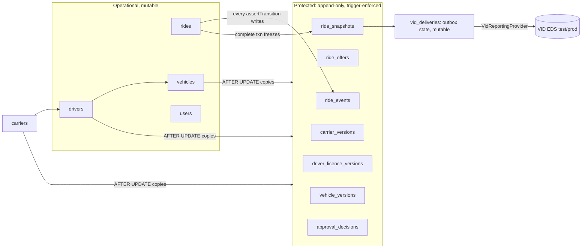
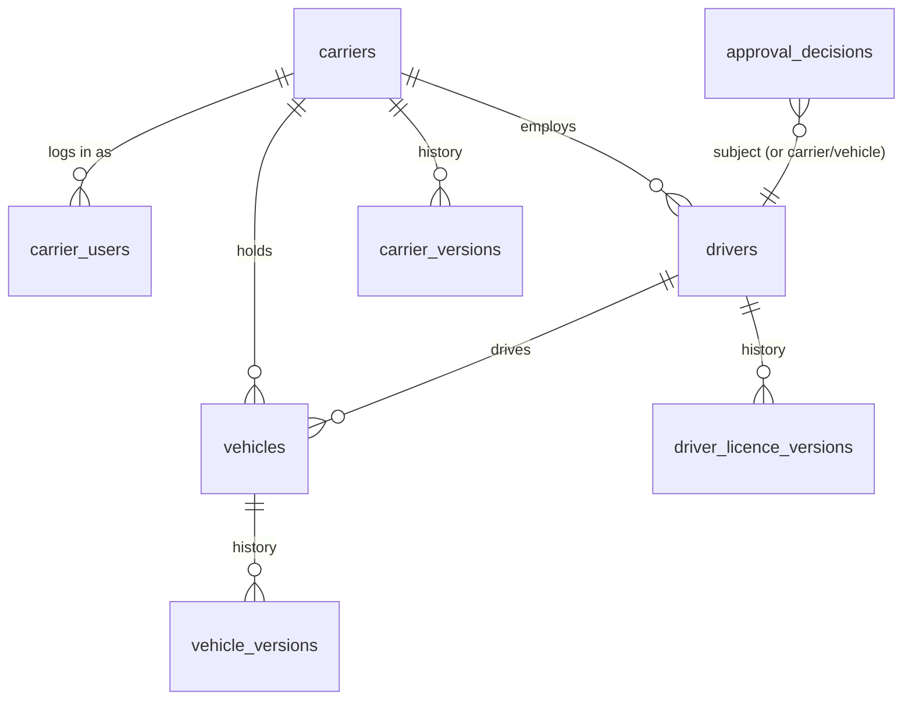

# Architecture — Sakta Cab compliance: lawful to operate in Latvia

Intent: [sakta-cab-compliance.prd.md](./sakta-cab-compliance.prd.md). Parent architecture: [sakta-cab.architecture.md](./sakta-cab.architecture.md) (this doc carries out its "Payments: card-only (2026-10-04)" section).

**Status:** decided 2026-10-04 in a `plan-architecture` session (Linards + Claude), on `main` at `658d052`. Evidence: the ten documents listed in the PRD header and `docs/research/`. Lawyer question IDs (A1–G9) are the ones in `docs/research/jautajumi-juristam.md`, the list the lawyer receives; in prose they read "lawyer E1" to keep them apart from the enforcement options "option E1–E4" (`append-only-enforcement-options.md`) and the code gaps G1–G10 (`compliance-code-gaps.md`). Where a decision waits on an unanswered **(bloķē)** question, the design states which answer switches what. No decision here guesses the law.

## Problem & goals

The PRD's MVP is **one rehearsal ride that would pass inspection**: a carrier registers a driver and a car with licence data; the rider sees MK 541 p. 8 information, pays by card (app or SMS link) and gets an e-invoice by email; one driver refuses with a reason, another completes; the ride reaches VID's test environment once; no part of it can be deleted or overwritten; driver and carrier both see it in their history. Every decision below is judged by whether it gets that ride through ATD, VID and the lawyer first time, inside the Q4 2026 guardrail, without a data shape that the law later forbids us to fix (35.² (5)).

## Approaches considered

Three overall shapes for the protected records, which is the decision everything else hangs on:

| Id | Shape | For | Against |
|---|---|---|---|
| AP1 | **Event log + narrow protected set** (chosen). Operational tables (`rides`, `drivers`, `vehicles`) stay mutable for lifecycle. A separate set of append-only tables holds the legal record: per-ride events, offers, the frozen completion snapshot, and versions of carrier, driver-licence and vehicle data. Raising triggers on that set. | Integration specs that edit `rides`/`drivers` fixtures keep working; rider PII stays out of the protected set, so erasure stays possible; one event table answers G3, G4, R3 and VID's start/end times together | Two places describe a ride (row + events); readers of history must read events, not the row |
| AP2 | **Freeze the operational tables**: column- and status-aware triggers on `rides`, `drivers`, `vehicles` themselves | No second model | Every trigger encodes the state machine a second time; breaks the spec fixtures listed in `append-only-enforcement-options.md` §3; rider PII on `rides.request` becomes undeletable |
| AP3 | **History tables on everything** (option E4 everywhere) | Fewest repository changes | Copies rider PII into undeletable history, which fights GDPR erasure; history of a mutable row is not an event log, so reasons and actors are still missing |

Payments were weighed as P1/P2/P3 (`card-only-payments.md`); P1's money flow with the invoice issuer behind a seam was chosen, so the P1/P3 difference is settled later by the lawyer, not by a rebuild.

## Recommended approach

Add a **compliance record layer** beside the existing slices, not a rewrite of them:



Brownfield fit: it reuses `assertTransition()` (one write point for events), the seam pattern in `packages/shared/src/seams/`, the 0003 hand-written-trigger migration pattern, the #309 approval gate's four enforcement points (they start checking licence validity instead of nothing), the sweeper (expiry of unpaid rides), the SMS seam and LV/RU/EN catalogs, and the merged web app (a `/carrier` area next to `/dispatch` and `/admin`).

## Key decisions

### K1 Protected-record model and enforcement (one-way door)

**Decided (Linards): AP1, enforced by option E1 (raising triggers) + option E4 (version copies), with option E3 as a complement.**

- **Protected set:** `ride_events`, `ride_offers`, `ride_snapshots`, `carrier_versions`, `driver_licence_versions`, `vehicle_versions`, `approval_decisions`. `BEFORE UPDATE OR DELETE` raises on all of them, except `ride_offers`, whose trigger allows exactly one forward move (`pending` → a terminal status, writing `responded_at` and `decline_reason` once) and raises on anything else.
- **DELETE is blocked** on `rides`, `carriers`, `drivers`, `vehicles`. Removing a car becomes deactivation (`retired_at`); `DELETE /vehicles/:id` goes (G1). `rides.vehicle_id ON DELETE SET NULL` becomes `NO ACTION` (G2). `unassignDriver` stops being a correction because the assignment and the release are both events.
- **Corrections are appends** (lawyer E2 asks to confirm this reading): editing a carrier, licence or vehicle field updates the operational row and the trigger copies the prior state into `*_versions`.
- **Option E3 complement:** an eslint `no-restricted-syntax` rule bans `.delete(` against the protected tables in `services/api/src`.
- **What the success test proves, stated plainly:** an integration test in the gate attempts UPDATE and DELETE on every protected table and on every DELETE-blocked table, through the repositories and as raw SQL, and expects each to raise. It runs as the `taxi` superuser, so it proves **no application code path can delete or overwrite**. It does not prove a superuser cannot (a superuser can disable triggers). Only **option E2** (a least-privilege api role) would prove that; it is **deferred**, recorded here, and is a single later ticket (second `DATABASE_URL`, grants migration, CI init, its own test) if the lawyer or ATD asks for it.
- **Lawyer E1 (bloķē) lands later without rework:** the snapshot and events carry no rider identity and no addresses. If the lawyer says identity and addresses are protected, we add the relevant table (`users` subset, `rides.request` addresses) to the trigger set; no data moves.

### K2 Ride history, per-status timestamps and reasons

- **`ride_events`**: one row per transition, written inside `assertTransition()`'s transaction: `ride_id`, `from_status`, `to_status`, `actor_kind` (rider/driver/dispatcher/admin/system), `actor_id`, `reason_code`, `reason_text`, `occurred_at`, plus the driver/vehicle ids for assignment and release events. Per-status timestamps (G4), cancel reasons and who cancelled (G3) and reassignment history come from here. `updated_at` stays a cache.
- **Reason enums live in `packages/shared`**: `CANCEL_REASONS` (per actor) and `DECLINE_REASONS`, each with LV/RU/EN strings. Decline and cancel calls get a required body.
- **Refusal reason to the passenger (MK 541 p. 7.3, R3):** an offer decline is stored with its reason but is not pushed to the rider (the next driver gets the offer; per-decline pushes would be noise). The rider is told the reason when the ride itself is refused: a driver cancels after acceptance, or no driver is found. *Assumption, flagged for the lawyer under document G6 (terms of use, which must state refusal reasons); say if this reading is wrong.*
- **Offered/refused trips (D1, bloķē):** kept in `ride_offers` + `ride_events` and handed over on request; not pushed. If D1 says they must be pushed, a second snapshot kind feeds the same outbox. "Offered" is recorded at the finest grain (each offer to each driver), which satisfies either reading of D1.

### K3 Carrier, licences, approvals (one data model for C1–C3, R5.2, G5)



- **`carriers`**: legal name, register number (11 characters, VID `CarriersTaxpayerCode`), ATD licence number + expiry, VAT status, payout account ref (K6), status. `drivers.fleet_id` becomes `drivers.carrier_id` with a real FK; vehicles get `carrier_id` too.
- **Driver licence fields**: taxi-driver register number (p. 8.2), `personas kods` or VID taxpayer code (VID `DriversPersonCode`, 11–12 characters). The person code is new, sensitive, national-ID data: encrypted at rest at column level, never logged, never projected to any API except the VID adapter and the driver's own profile. Key handling is tied to **D5** (VID key hand-over).
- **Vehicle fields**: licence-card number + expiry, `wheelchair_accessible` flag (p. 8.8).
- **Verification provenance**: each licence record carries `verified_by` (`carrier_attestation` | `admin_document_check` | `atd_lookup`) and a document reference. **B1 (bloķē)** decides which is enough; adding an ATD lookup later is a new writer of the same field, not a reshape.
- **`approval_decisions`** (append-only): subject (carrier/driver/vehicle), decision (`approve`/`reject`/`suspend`/`reinstate`/`review_requested`), required reason code + text, actor, time. `drivers.status` gains `suspended` (today `rejected` doubles for it). The current approval is derived from the latest decision. A driver is told the decision and reason, and can request review (a decision row). Platform Work Directive Art. 10(5)/11 shape; human-only decisions, as today.
- **Approval gate**: approval requires carrier active + licence unexpired, driver fields present, vehicle licence card unexpired. The existing four #309 enforcement points (go-online, candidate filter, force-assign, reassign) re-check **expiry** at the time of use, not just the status flag.

### K4 Carrier login (MK 541 p. 7.1, 7.5)

- New `carrier` value in `USER_ROLES` (pgEnum migration) and a `carrier_users` link. Same phone-OTP + JWT auth; the web login stops hardcoding role `rider`. Carriers are provisioned by admin (extend `provision-staff`), not self-signup.
- A `/carrier` area in `apps/dispatch`: register drivers and vehicles (carrier-created drivers still need admin approval), see licence expiry, list trips. **Carrier scoping is the main risk**: every carrier route takes `carrierId` from the token, never the request, and a shared guard + repository parameter enforce it; a test proves carrier A cannot read carrier B.
- Trip access for **≥ 5 years** (p. 7.5): list + CSV export read from `ride_events`/`ride_snapshots`/`ride_offers` (accepted, refused, provided).
- **Driver 3-month history (p. 7.4)**: a 90-day trip list in the driver app from the same read model. This reverses `earnings-screen.tsx`'s "Q1 = Option B" (Linards, decided). It also serves APL 40. (10): the driver shows the trip record to an inspector.

### K5 Card-only and the hold-at-booking flow (largest change)

**Decided (Linards): hold the quoted fare before dispatch on both channels.**

```
app booking ──┐                      dispatcher phone booking
  PaymentSheet│                         SMS pay link (Checkout Session)
              └──> awaiting_payment <───┘
                       │ webhook: payment authorised (manual capture)
                       v
                   requested ──> sweeper dispatches ──> ... completed
                       │                                      │
     expiry sweep ──> cancelled_by_system (hold released)     capture at settle
```

- **New ride status `awaiting_payment`** before `requested`, through `ALLOWED_TRANSITIONS` and a pgEnum migration. `findAwaitingDispatch` keeps reading `requested`, so nothing is dispatched unpaid. Touch list (from C4): `ride-entry.ts`, board statuses and console labels, notifications policy, tracking, driver active-ride state, realtime events, SMS template (LV/RU/EN).
- **One authorise path, two surfaces:** a manual-capture PaymentIntent. The app confirms it in-app (Stripe PaymentSheet); the phone rider confirms it through a one-off Checkout Session URL sent by SMS. 3DS happens while the rider is present on both, which retires today's "`requires_action` = declined".
- **Seam:** `PaymentsProvider` gains `authorise` (returns a client secret or a pay URL), `capture` (with `amount_to_capture`), `release`, and webhook event parsing; `charge()` goes. A signed, idempotent (by provider event id) webhook endpoint is new.
- **Unpaid expiry:** the sweeper cancels `awaiting_payment` rides past a timeout to `cancelled_by_system`; the timeout value is set in the ticket plan (`expected`).
- **Scheduled rides:** the hold is placed at booking, so the scheduling horizon is capped at **6 days** (`derived`: Stripe's reported 7-day hold for customer-present online cards minus a 1-day margin; the 7 days is research-agent reported in `card-only-payments.md`, not hand-verified). Today there is no horizon cap.
- **Cash removal** across **29 shipped source files** (`observed` 2026-10-04, `grep -rlE '\bcash\b'` over shared, api, the three apps and db, specs excluded): `BOOKABLE_PAYMENT_METHODS` becomes `['card']`, the cash branches in quote, settlement, ledger, candidate filter, rider chips, driver receipt and phone form go. The `cash` pgEnum value stays as a dead value (dropping an enum value in Postgres means rebuilding the type) and a CHECK forbids new cash rows. The phone form comment "card is unsettleable at the kerb" goes.
- **Phone orders and C1 (bloķē):** if the lawyer says dispatcher-entered phone orders breach 40. (13) 4), the phone channel is switched off by config; the app flow does not depend on it.

### K6 Money flow and merchant of record

**Decided (Linards): P1's money flow; the invoice issuer stays behind a seam until C3/C4 are answered.**

- Stripe Connect **destination charge `on_behalf_of` the carrier**: hold at booking, capture at settle, **15% `application_fee_amount`** resolved by `resolveCommissionPct()` at offer build, as today. The carrier's connected account is paid out by Stripe, which retires the pilot SEPA batch from spike #5.
- **Ledger:** gains `carrier` as an owner; the six-line platform-as-merchant entries are rewritten to carrier-as-seller + platform-commission. Integer cents throughout; euros only inside adapters.
- **Every carrier passes Stripe KYC before its first ride**: carrier approval (K3) requires an active connected account. Disputes and failed captures sit with the platform under destination charges (Stripe), and contractually per **C6**.
- **Invoice:** an `InvoiceIssuer` boundary with two implementations possible: Stripe Invoicing in the carrier's name (P1) or a platform-generated PVN 125/126 invoice (P3). **C3/C4 (bloķē)** picks one; the ride data either needs is already in the snapshot.
- **Gated on the company (A1, bloķē):** live keys, Connect platform account and ATD registration all wait on the IK/SIA. Everything is built and rehearsed in Stripe test mode.

### K7 Email, e-invoice and rider email (R7, 35.² (1) 5) c), 37. (5))

- New `EmailProvider` seam in `packages/shared/src/seams/` (send with a template key + locale + attachment). Provider choice is a two-way door made in the ticket plan, judged on EU sending, cost under the €100/mo budget and SPF/DKIM setup.
- **App riders:** email becomes required at onboarding (37. (5) says the invoice goes to the email registered in the app). **Phone riders:** the Checkout page collects the email.
- At settlement the invoice is generated (K6) and emailed; a sent-invoice record lets the PRD's "100% of completed card rides get an e-invoice" metric be counted.

### K8 Rider trip card and receipt (MK 541 p. 8)

One read model serves the rider status screen and the public tracking page: carrier name + register number, driver name + register number, plate, €/km and €/min rates with "no extras", estimate, start and destination, wheelchair option, passenger/luggage rules text, complaints and out-of-court dispute text (LV/RU/EN static), and after completion a receipt (start/end time from `ride_events`, payment confirmation). Wheelchair (R5.8) is folded in: vehicle flag + ride option + candidate-filter condition + booking toggle.

### K9 VID reporting seam and outbox (one-way door)

**Decided (Linards): the frozen snapshot is the outbox body.**

- **`ride_snapshots`** (protected): written in `complete()`'s transaction. Holds the p. 11 fields only: carrier register number, driver person code (encrypted), plate, start/end time, distance, fare, commission, payment type, plus the **exact serialized VID body** and `distance_source`. Unique on `ride_id`. No rider identity, no addresses.
- **`vid_deliveries`** (outbox state, mutable, not protected): status `pending` → `delivered` | `duplicate` | `rejected` | `blocked`, attempts, last response, receipt. Retries resend the stored body byte for byte, so a lost response comes back 409, never a second record that cannot be withdrawn (no correction call exists, D4).
- **`VidReportingProvider`** seam: input `{ rideId, credentialRef, body }`, output `delivered | duplicate | rejected | retryable | blocked`. Response handling as in `vid-eds-api-integration.md` (201/409 delivered; 400 dead-letter and alert, never edit-and-resend; 401 refresh once; 403 pause queue; 429 and network errors backoff). Field lengths are validated before enqueue.
- **Distance has no driven source today.** `rides.trip_distance_meters` is the routed estimate written at creation; GPS is Redis-only with a 60 s TTL (gap G6). **Decided: report the routed distance** with `distance_source = 'routed'`, consistent with the fixed fare it priced. If the lawyer's **C9** answer requires driven distance, server-side distance accumulation from the location stream is added and the source flips to `driven`; snapshots already written stay as they are and say which source they used. Persisting GPS also raises **C10**.
- **Timestamps** are formatted in Europe/Riga local time in the adapter (assumption until **D3**); the snapshot stores UTC plus the formatted string, so D3 changes only the formatter for future rides.
- **Credentials:** `credentialRef` resolves per carrier, falling back to a platform credential. **D2 (bloķē)** decides which exists; both fit the seam. Getting EDS credentials needs a registered taxpayer, so the live rehearsal waits on A1.

### K10 Rider erasure vs no-delete

- Boundary: protected tables hold no rider identity. Erasure **pseudonymises** `users`/`customers` (name, phone, email → null or a random token), deletes saved places and push tokens, and nulls rider identity inside `rides.request`. Pickup/drop-off addresses on `rides.request` are nulled too **unless lawyer E1 says they are protected**; that is one flag in the erasure job.
- An `erasure_requests` log (pseudonymous id + time) lets erasures be re-applied after a backup restore (K12).
- Correction under GDPR Art. 16 for protected data is an append (lawyer E2).

### K11 Staff access log (C5, G10)

`staff_access_log` table, persisted, written from the read paths that show personal data to staff: admin driver list/detail, dispatch board, roster, customer lookup/venues/create, pickup PIN. It is **not** in the protected set: FPDAL 37 caps such logs at about **1 year** (`statute`, P30 in `gdpr-platform-obligations.md`), so it has a purge job. Admin/dispatcher *actions* on drivers are covered by `approval_decisions` and the version tables; the phone-booking audit insert becomes part of the ride's transaction instead of log-only.

### K12 Retention and backups

- **The primary database is the 5-year store** (35.² (6), at least 5 years in the EU/NATO). No purge code for protected data is written until **lawyer E3** sets the end point.
- **Backups stay a rolling disaster-recovery window** (today 30 days remote, 7 local, `observed` in `scripts/backup-db.sh:25-26`); the runbook says plainly they are not the retention mechanism. The restore procedure gains "re-apply erasures". The R2 bucket gets an EU jurisdiction lock rather than the WEUR location hint (P4). The VID key hand-over procedure (MK 541 p. 10, **D5**) is a runbook document, not code.
- **VID access within 10 working days (p. 10):** served by the carrier/admin export over the protected tables; no extra endpoint.

### Other calls, skipped or unchanged

- **Offline rule (R1):** already met; no change.
- **Fare calculated in the app (R2, C9):** no change until the lawyer answers; K9's `distance_source` is the only hook needed.
- **Stack & libraries:** no new framework. New dependencies are the Stripe React Native SDK (PaymentSheet) in the rider app and one email provider SDK in the api, both behind seams. Everything else is the existing NestJS/Drizzle/Next/Expo stack.

## Systems check

- **What accumulates:** protected rows grow forever (no purge until lawyer E3). At pilot scale this is small; the 5-year read paths need indexes on `(carrier_id, occurred_at)` and `(driver_id, occurred_at)`. The VID outbox can back up silently on a 403 pause; an alert on oldest-pending age is part of the outbox ticket.
- **Delayed feedback:** a wrong VID body is permanent (no correction call). The pre-enqueue validation and the test-environment rehearsal are the only checks before it counts. A wrong reading of 35.² (5) shows up at ATD's yearly check (p. 13), months later.
- **Bottleneck once it works:** carrier onboarding (Stripe KYC + licence data + admin approval) gates every new driver. It is manual by design.
- **Gaming:** a carrier could attest to licences it does not hold (B1 decides whether attestation is enough); expiry re-checks at the four gate points limit the window.

## Missing pieces

- Company (A1) → Stripe live + Connect platform, EDS credentials, ATD registration. Outside the code; the critical path for the real rehearsal.
- Lawyer answers to A1, B1, C1, C3, D1, D2, E1. Each has a named switch above.
- Ordering for slicing (sizes `expected`, not measured):

| Part | Covers | Depends on | Size |
|---|---|---|---|
| Protected record layer: `ride_events`, reasons, triggers, no-delete test, vehicle delete removal | K1, K2, G1–G4, G9 | — | L |
| Carrier + licence model, approval decisions, suspension, expiry gates | K3, C2, C3, G5, G10 | protected layer | L |
| Carrier login + scoped registration + 5-year trips; driver 90-day history + decline reason picker | K4, R3, R4, C1 | carrier model | L |
| Cash removal | K5 | — | M |
| Payments: seam authorise/capture/release, webhook, `awaiting_payment`, app hold, phone SMS link, expiry | K5, C4 | cash removal | XL (likely two tickets: app path, then phone path) |
| Connect destination charge + ledger rewrite + email seam + invoice | K6, K7, R7 | payments, carrier model | L |
| Rider trip card, receipt, tracking page, static texts, wheelchair | K8, R5 | carrier model | M |
| VID snapshot, outbox, adapter, test-env rehearsal | K9 | protected layer, carrier model | L |
| Staff access log, rider erasure, retention/backup runbook | K10–K12, C5, G7, G8 | protected layer | M |

Roughly 10–11 tickets. Whether that fits Q4 2026 (about 12 weeks from 2026-10-04, `derived`: Oct 4 → Dec 31) is the PRD's guardrail; the slicing pass should check it against real velocity.

## Spikes & experiments

**S1 — Stripe Connect for LV carriers** (1 day, before the payments tickets)
- Question: does an Express connected account for a Latvian IK and SIA support destination charges with `on_behalf_of`, a manual-capture PaymentIntent confirmed through both PaymentSheet and a Checkout Session, and `amount_to_capture` + `application_fee_amount` at capture?
- Spike: test-mode platform, two connected accounts (individual, company), one ride through each surface.
- Decision rule: all work → K6 as written; IK cannot onboard → carriers must be companies or we fall back to P2 for IKs (raise with the lawyer under B2).

**S2 — VID test environment** (½ day once EDS access exists; blocked on A1)
- Question: which fields drive the 409, what timezone is expected, does one platform `client_id` work (D2)?
- Spike: retrieve developer guide media/1285 first (not yet read), then post two identical and one differing body.
- Decision rule: 409 on identical body → K9's byte-for-byte resend stands; no 409 → add a client-side "delivered" check from the EDS report before any retry.

## Open questions

Deferred deliberately, each with what settles it:

| Lawyer Q | Blocks | Default until answered | Switch when answered |
|---|---|---|---|
| A1 (bloķē) | live payments, EDS, ATD | test mode only | create company, live keys |
| B1 (bloķē) | licence verification | admin document check | add `atd_lookup` writer |
| C1 (bloķē) | phone channel | built, config-gated | turn phone channel off |
| C3 / C4 (bloķē) | invoice issuer | `InvoiceIssuer` seam, no live issuer | pick P1 or P3 implementation |
| C9 | VID distance | `routed` | add driven-distance accumulation |
| D1 (bloķē) | offered/refused push | kept, not pushed | second snapshot kind into the same outbox |
| D2 (bloķē) | VID credentials | per-carrier with platform fallback | configure the one that exists |
| D3 | VID timestamps | Europe/Riga local | change formatter |
| D5 | key hand-over | runbook procedure | adjust procedure |
| E1 (bloķē) | erasure scope | addresses nulled on erasure | add tables to trigger set, skip address null |
| E3 | retention end | no purge | add purge job |
| document G6 | refusal reason shown per ride, not per offer | as in K2 | push per offer |
